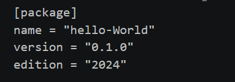
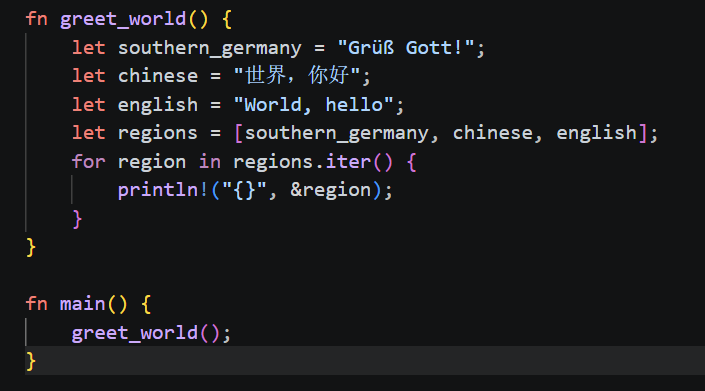
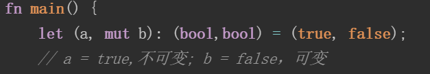

# rust指令学习
**建立项目：** cargo new \<project> ：创建一个rust项目名为project
**编译项目：** cargo build
**编译+执行当前所在项目：** cargo run
**检查代码能否编译通过：** cargo check

-------
# rust文件构成
## cargo.toml和cargo.lock
Cargo.toml 和 Cargo.lock 是 cargo 的核心文件，它的所有活动均基于此二者。

**Cargo.toml** 是 cargo 特有的项目数据描述文件。它存储了项目的所有元配置信息，如果 Rust 开发者希望 Rust 项目能够按照期望的方式进行构建、测试和运行，那么，必须按照合理的方式构建 Cargo.toml。

**Cargo.lock** 文件是 cargo 工具根据同一项目的 toml 文件生成的项目依赖详细清单，因此我们一般不用修改它，只需要对着 Cargo.toml 文件撸就行了。
>什么情况下该把 Cargo.lock 上传到 git 仓库里？很简单，当你的项目是一个可运行的程序时，就上传 Cargo.lock，如果是一个依赖库项目，那么请把它添加到 .gitignore 中。

## 详细解析cargo.toml
* ### package段落
  
    总体描述了项目相关信息
    * name定义项目名称
    * version定义当前版本
    * edition定义所用的rust大版本
* ### 定义项目依赖

---
# rust语言语法学习
==编写所在区域：.rs文件==

## hello，World的示例

* println!()中的!表示宏操作符
* println!()内部的占位符是{}，会自动识别数据类型
* rust不支持直接循环，需要通过iter()方法变成迭代器进行循环
==但在最新的rust版本中可直接for region in regions{}，因为for隐式地将regions变为了迭代器==
* 控制流：for 和 continue 连在一起使用，实现循环控制。
* 方法语法：由于 Rust 没有继承，因此 Rust 不是传统意义上的面向对象语言，但是它却从 OO 语言那里偷师了方法的使用 record.trim()，record.split(',') 等。
* 高阶函数编程：函数可以作为参数也能作为返回值，例如 .map(|field| field.trim())，这里 map 方法中使用闭包函数作为参数，也可以称呼为 匿名函数、lambda 函数。
* 类型标注：if let Ok(length) = fields[1].parse::<f32>()，通过 ::<f32> 的使用，告诉编译器 length 是一个 f32 类型的浮点数。这种类型标注不是很常用，但是在编译器无法推断出你的数据类型时，就很有用了。
* 隐式返回：Rust 提供了 return 关键字用于函数返回，但是在很多时候，我们可以省略它。因为 Rust 是 基于表达式的语言。
---
## 变量
### 变量可分为可变变量和不可变变量
* **变量绑定（类似赋值）**：
    * let a = "hhhhh";
    ==这种变量绑定默认了该变量是不可变变量==
    * let mut a = "hhhhhh";
    ==变量a就声明为了可变变量==
    * let _a = "hhhhhh";
    ==告诉编译器我声明的这个变量a没被使用，但这有用，你不用警告==
* **变量解构**
    * 可用let指令进行变量解构 
    ==":"代表类型标注符号，说明左边的变量是右边的类型，当绑定的类型非常典型明确时可以不用==
* **常量和变量**
    * 常量代表从始至终都不可变
    * 常量必须用const声明，且必须标注类型
    >例如一个常量声明：const NUM:u32 = 100_000 
    >//声明常量NUM为u32类型，且值为100,000
* **变量遮蔽**
    * 同一个变量能够重复声明，但后面声明的变量会遮蔽前面的变量
    ```rust
    fn main() {
    let x = 5;
    // 在main函数的作用域内对之前的x进行遮蔽
    let x = x + 1;
    
    {
        // 在当前的花括号作用域内，对之前的x进行遮蔽
        let x = x * 2;
        println!("The value of x in the inner scope is: {}", x);
    }
    
    println!("The value of x is: {}", x);
    }
    ```
    所得到的输出：
    >    $ cargo run
    Compiling variables v0.1.0 (file:///projects/variables)
    ...
    The value of x in the inner scope is: 12
    The value of x is: 6

---
## 基本类型
* ### 类型推导与标注
  * rust能根据上下文进行推测该绑定的变量的类型，因此很多情况下不需要去声明所用变量的类型
  * 但有时无法推测时，就必须加入“:”来显式标注该变量的类型
* ### 数值类型
  * 整数类型
  ==rust整型默认使用i32，同时该类型也是性能最好的==
    >* 整型溢出
    >假设有一个 u8 ，它可以存放从 0 到 255 的值。那么当你将其修改为范围之外的值，比如 256，则会发生整型溢出。关于这一行为 Rust 有一些有趣的规则：当在 debug 模式编译时，Rust 会检查整型溢出，若存在这些问题，则使程序在编译时 panic(崩溃,Rust 使用这个术语来表明程序因错误而退出)。
        >
        >在当使用 --release 参数进行 release 模式构建时，Rust 不检测溢出。相反，当检测到整型溢出时，Rust 会按照补码循环溢出（two’s complement wrapping）的规则处理。简而言之，大于该类型最大值的数值会被补码转换成该类型能够支持的对应数字的最小值。比如在 u8 的情况下，256 变成 0，257 变成 1，依此类推。程序不会 panic，但是该变量的值可能不是你期望的值。依赖这种默认行为的代码都应该被认为是错误的代码。
  * 浮点数类型
         浮点类型数字 是带有小数点的数字，在 Rust 中浮点类型数字也有两种基本类型： f32 和 f64，分别为 32 位和 64 位大小。默认浮点类型是 f64，在现代的 CPU 中它的速度与 f32 几乎相同，但精度更高。

        >* 浮点数陷阱
        >浮点数由于底层格式的特殊性，导致了如果在使用浮点数时不够谨慎，就可能造成危险，有两个原因：
        >浮点数往往是你想要数字的近似表达 浮点数类型是基于二进制实现的，但是我们想要计算的数字往往是基于十进制，例如 0.1 在二进制上并不存在精确的表达形式，但是在十进制上就存在。这种不匹配性导致一定的歧义性，更多的，虽然浮点数能代表真实的数值，但是由于底层格式问题，它往往受限于定长的浮点数精度，如果你想要表达完全精准的真实数字，只有使用无限精度的浮点数才行
        >浮点数在某些特性上是反直觉的 例如大家都会觉得浮点数可以进行比较，对吧？是的，它们确实可以使用 >，>= 等进行比较，但是在某些场景下，这种直觉上的比较特性反而会害了你。因为 f32 ， f64 上的比较运算实现的是 std::cmp::PartialEq 特征(类似其他语言的接口)，但是并没有实现 std::cmp::Eq 特征，但是后者在其它数值类型上都有定义

        ==为了避免上面说的两个陷阱，你需要遵守以下准则：1.避免在浮点数上测试相等性；2.当结果在数学上可能存在未定义时，需要格外的小心==