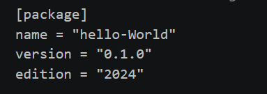
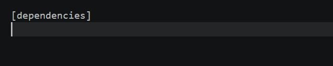
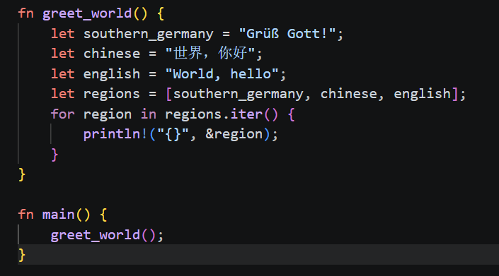
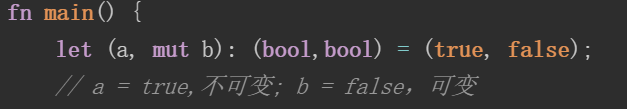
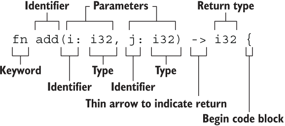
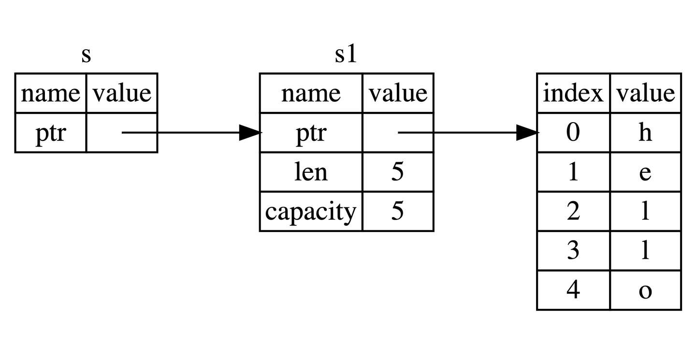
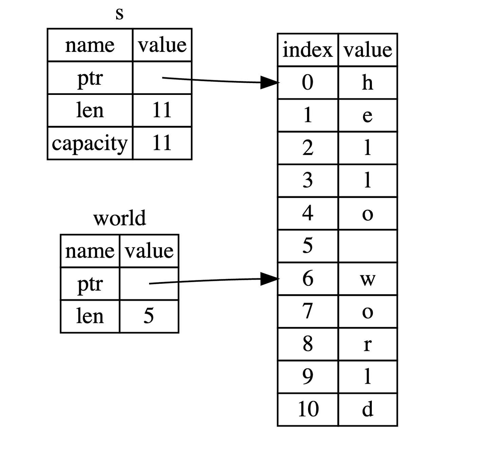
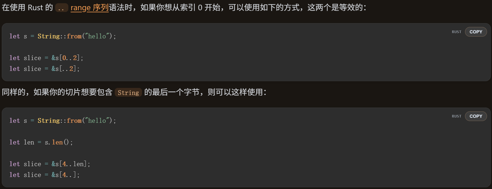

# rust指令学习
**建立项目：** cargo new \<project> ：创建一个rust项目名为project
**编译项目：** cargo build
**编译+执行当前所在项目：** cargo run
**检查代码能否编译通过：** cargo check

----
-------

# rust文件构成
## cargo.toml和cargo.lock
Cargo.toml 和 Cargo.lock 是 cargo 的核心文件，它的所有活动均基于此二者。

**Cargo.toml** 是 cargo 特有的项目数据描述文件。它存储了项目的所有元配置信息，如果 Rust 开发者希望 Rust 项目能够按照期望的方式进行构建、测试和运行，那么，必须按照合理的方式构建 Cargo.toml。

**Cargo.lock** 文件是 cargo 工具根据同一项目的 toml 文件生成的项目依赖详细清单，因此我们一般不用修改它，只需要对着 Cargo.toml 文件撸就行了。
>什么情况下该把 Cargo.lock 上传到 git 仓库里？很简单，当你的项目是一个可运行的程序时，就上传 Cargo.lock，如果是一个依赖库项目，那么请把它添加到 .gitignore 中。

## 详细解析cargo.toml
* ### package段落
  
    总体描述了项目相关信息
    * name定义项目名称
    * version定义当前版本
    * edition定义所用的rust大版本
* ### 定义项目依赖库（该项目需要的库文件）
  
  ==由于我们新创建的项目还没导入依赖库，所以这区域为空==

---
---

# rust语言语法学习
==编写所在区域：.rs文件==

## hello，World的示例

* println!()中的!表示宏操作符
* println!()内部的占位符是{}，会自动识别数据类型
* rust不支持直接循环，需要通过iter()方法变成迭代器进行循环
==但在最新的rust版本中可直接for region in regions{}，因为for隐式地将regions变为了迭代器==
* 控制流：for 和 continue 连在一起使用，实现循环控制。
* 方法语法：由于 Rust 没有继承，因此 Rust 不是传统意义上的面向对象语言，但是它却从 OO 语言那里偷师了方法的使用 record.trim()，record.split(',') 等。
* 高阶函数编程：函数可以作为参数也能作为返回值，例如 .map(|field| field.trim())，这里 map 方法中使用闭包函数作为参数，也可以称呼为 匿名函数、lambda 函数。
* 类型标注：if let Ok(length) = fields[1].parse::<f32>()，通过 ::<f32> 的使用，告诉编译器 length 是一个 f32 类型的浮点数。这种类型标注不是很常用，但是在编译器无法推断出你的数据类型时，就很有用了。
* 隐式返回：Rust 提供了 return 关键字用于函数返回，但是在很多时候，我们可以省略它。因为 Rust 是 基于表达式的语言。
---
## 变量
### 变量可分为可变变量和不可变变量
* **变量绑定（类似赋值）**：
    * let a = "hhhhh";
    ==这种变量绑定默认了该变量是不可变变量==
    * let mut a = "hhhhhh";
    ==变量a就声明为了可变变量==
    * let _a = "hhhhhh";
    ==告诉编译器我声明的这个变量a没被使用，但这有用，你不用警告==
* **变量解构**
    * 可用let指令进行变量解构 
    ==":"代表类型标注符号，说明左边的变量是右边的类型，当绑定的类型非常典型明确时可以不用==
* **常量和变量**
    * 常量代表从始至终都不可变
    * 常量必须用const声明，且必须标注类型
    >例如一个常量声明：const NUM:u32 = 100_000 
    >//声明常量NUM为u32类型，且值为100,000
* **变量遮蔽**
    * 同一个变量能够重复声明，但后面声明的变量会遮蔽前面的变量
    ```rust
    fn main() {
    let x = 5;
    // 在main函数的作用域内对之前的x进行遮蔽
    let x = x + 1;
    
    {
        // 在当前的花括号作用域内，对之前的x进行遮蔽
        let x = x * 2;
        println!("The value of x in the inner scope is: {}", x);
    }
    
    println!("The value of x is: {}", x);
    }
    ```
    所得到的输出：
    >    $ cargo run
    Compiling variables v0.1.0 (file:///projects/variables)
    ...
    The value of x in the inner scope is: 12
    The value of x is: 6

---
## 基本类型
### 类型推导与标注
  * rust能根据上下文进行推测该绑定的变量的类型，因此很多情况下不需要去声明所用变量的类型
  * 但有时无法推测时，就必须加入“:”来显式标注该变量的类型
### 数值类型
#### 整数类型

  ==rust整型默认使用i32，同时该类型也是性能最好的==
>* 整型溢出
    >假设有一个 u8 ，它可以存放从 0 到 255 的值。那么当你将其修改为范围之外的值，比如 256，则会发生整型溢出。关于这一行为 Rust 有一些有趣的规则：当在 debug 模式编译时，Rust 会检查整型溢出，若存在这些问题，则使程序在编译时 panic(崩溃,Rust 使用这个术语来表明程序因错误而退出)。
        >
        >在当使用 --release 参数进行 release 模式构建时，Rust 不检测溢出。相反，当检测到整型溢出时，Rust 会按照补码循环溢出（two’s complement wrapping）的规则处理。简而言之，大于该类型最大值的数值会被补码转换成该类型能够支持的对应数字的最小值。比如在 u8 的情况下，256 变成 0，257 变成 1，依此类推。程序不会 panic，但是该变量的值可能不是你期望的值。依赖这种默认行为的代码都应该被认为是错误的代码。

进制表达：默认十进制，八进制（前缀：0o），二进制（前缀：0b），十六进制（前缀：0x）
#### 浮点数类型
     
浮点类型数字 是带有小数点的数字，在 Rust 中浮点类型数字也有两种基本类型： f32 和 f64，分别为 32 位和 64 位大小。默认浮点类型是 f64，在现代的 CPU 中它的速度与 f32 几乎相同，但精度更高。

>* 浮点数陷阱
        >浮点数由于底层格式的特殊性，导致了如果在使用浮点数时不够谨慎，就可能造成危险，有两个原因：
        >浮点数往往是你想要数字的近似表达 浮点数类型是基于二进制实现的，但是我们想要计算的数字往往是基于十进制，例如 0.1 在二进制上并不存在精确的表达形式，但是在十进制上就存在。这种不匹配性导致一定的歧义性，更多的，虽然浮点数能代表真实的数值，但是由于底层格式问题，它往往受限于定长的浮点数精度，如果你想要表达完全精准的真实数字，只有使用无限精度的浮点数才行
        >浮点数在某些特性上是反直觉的 例如大家都会觉得浮点数可以进行比较，对吧？是的，它们确实可以使用 >，>= 等进行比较，但是在某些场景下，这种直觉上的比较特性反而会害了你。因为 f32 ， f64 上的比较运算实现的是 std::cmp::PartialEq 特征(类似其他语言的接口)，但是并没有实现 std::cmp::Eq 特征，但是后者在其它数值类型上都有定义

        
==为了避免上面说的两个陷阱，你需要遵守以下准则：1.避免在浮点数上测试相等性；2.当结果在数学上可能存在未定义时，需要格外的小心==


#### NaN
特殊的浮点数类型，表示不合法的数学处理（除以0，负数取平方根等）
* 任何与NaN的操作都会返回NaN，且无法用来比较，否则会崩溃（panic！）
* 可使用is_nan()方法来检测是否是NaN

#### 运算符
 * 支持所有的基本数字运算
 * 支持所有的位运算（和其他语言一样）==rust会检测所有移位运算后的数值是否超出类型确定的范围，如果是则报错“overflow”==

#### 序列
**一个简洁的表达式生成连续的数字**
* 例如1..5：生成1到4的连续数字 **（左开右闭区间）**
* 1..=5 ：生成1到5的连续数字 **（闭区间）**
==序列只能用于数字或字符类型==
这个表达经常用于循环中：
```rust
for i in 1..=5 {
    println!("{}",i);
}
```

#### 有理数和复数
有专门的库：num 提供

#### 类型转换
采用as关键词，用法示例：
```rust
fn main() {
    let v: u16 = 38_u8 as u16;
}
```

### 字符、布尔、单元类型
#### 字符（char）
一个字符固定占用4字节（utf-32）
#### 布尔（bool）
一个bool（false，true）占用1字节
#### 单元（（））
**==单元类型称为unit，表示就是一个()==**
()类型有且只有一个值(),比如f==main()函数的返回类型就是单元类型()==，所以main函数是有返回值的函数，而没有返回值的函数被称为发散函数。比如常见的==println()就是一个返回()的宏==
它可以代表是无所谓，无意义。比如在map中我们可以用()作为map的值，代表我们只关注key，而不关注值
占用字节0字节，不占内存，单纯占位

### 语句和表达式
==二者的概念需要明确分清，因为语句不会返回值，但表达式总是会==
#### 语句
```rust
let a = 8;
let b: Vec<f64> = Vec::new();
let (a, c) = ("hi", false);
```
以上是一些语句。因为他们==完成了具体的操作==，但是==没有返回值==
#### 表达式

完成求值，然后必定要返回值，那么就是表达式。表达式能成为语句的一部分。调用函数是表达式，调用有返回值的宏也是表达式，甚至一个花括号包起来的程序块也可以是一个表达式，例如这有段程序：
```rust
fn main() {
    let y = {
        let x = 3;
        x + 1
    };

    println!("The value of y is: {}", y);
}
```
当中的：
```rust
{
    let x = 3;
    x + 1
}
```
同样是一个表达式，因为x+1是一个表达式，它会返回一个值，所以最终y=4。
==但注意！表达式没有“;”来结尾，否则表达式将变成语句，也不会返回值。所以上述{}中的表达式就没有;以此来返回值==
**如果表达式不返回任何一个值，那么表达式将会返回一个单元类型()**

### 函数
函数声明构成：


#### 函数要点
* 函数名和变量名使用蛇形命名法(snake case)，例如 fn add_two() {}
* 函数的位置可以随便放，Rust 不关心我们在哪里定义了函数，只要有定义即可
* 每个函数参数都需要标注类型

#### 函数返回
##### 两种方式：
1. 最后一条表达式
2. return指令提前返回
示例：
```rust
fn plus_or_minus(x:i32) -> i32 {
    if x > 5 {
        return x - 5
    }

    x + 5
}
```
==注意：return作为表达式同样不加“;”同时return expr本身是表达式，可返回!（与返回！的表达式连用），但return作为语句（末尾加;）时由于return后不可达，编译器依旧会认为return后语句不可达，返回!==(如果直接return ; 则认为返回() )
##### 特殊返回类型
* 单元类型返回
    函数没有返回值则返回一个()
    以“;”结尾的语句返回一个()
#### 发散函数
永远不会有返回值的函数，以 ==！==作为声明函数时的返回值
```rust
//特别的，这种语法往往用做会导致程序崩溃的函数：
fn dead_end() -> ! {
  panic!("你已经到了穷途末路，崩溃吧！");
}

//该函数创建了一个无限循环，所以调用后永远不会有返回值
fn forever() -> ! {
  loop {
    //...
  };
}
```

---
## <u> *所有权和借用* （及其重要） </u>
用于完全避免程序不安全问题的rust特有特性

### 所有权

#### 所有权和堆栈
当你的代码调用一个函数时，传递给函数的参数（包括可能指向堆上数据的指针和函数的局部变量）依次被压入栈中，当函数调用结束时，这些值将被从栈中按照相反的顺序依次移除。

因为堆上的数据缺乏组织，因此跟踪这些数据何时分配和释放是非常重要的，否则堆上的数据将产生内存泄漏 —— 这些数据将永远无法被回收。这就是 Rust 所有权系统为我们提供的强大保障。

#### 所有权原则
> 1. rust中每一个值被一个变量拥有，该变量称为这个值的所有者
> 2. 一个值同时只能被一个变量所拥有，或者说一个值只能拥有一个所有者
> 3. 当所有者（变量）离开作用域范围时，这个值将被丢弃(drop)
==作用域的划定是依靠{}决定的，与c++的作用域类似==

#### 转移所有权（移动move）
1. 基本类型的绑定和赋值一般不会转移所有权，而是拷贝数据来赋值，操作和数据都在**栈**上完成和存储。由于是拷贝的方式完成，所以不会转移所有权（基本类型的拷贝非常快，对性能影响很小）
```rust
let x = 5;
let y = x;
```

2. 复杂类型的绑定和赋值由于存储复杂且较大，所以会在**堆**上存储和操作，因此rust不会自动采取拷贝的方式进行，而是转移所有权(移动)来保证性能。
==转移所有权是指拷贝string**本身(代表自身的指针的转移)** 给s2，而不是复制一个一模一样的另一个实例出来（克隆）。对于rust而言，再认为原来的s1失效了。于是表面上就像是<u>转移所有权</u>。（拷贝本身比克隆性能要快很多，因为只需要把对应的指针，和其他信息给新的变量，而不需要去复制一份新的一模一样的数据）==
本质实现上来说，移动就是先浅拷贝，然后删掉原变量。
```rust
let s1 = String::from("hello");
let s2 = s1;
```

3. 当所有权转移的时候同时可以转移可变性（mut）
```rust
fn main() {
    let s = String::from("hello, ");
    
    // 只修改下面这行代码 !
    let mut s1 = s;

    s1.push_str("world")
}
```

4. 部分 move
当解构一个变量时，可以同时使用 move 和引用模式绑定的方式。当这么做时，部分 move 就会发生：变量中一部分的所有权被转移给其它变量，而另一部分我们获取了它的引用。

在这种情况下，原变量将无法再被使用，但是它没有转移所有权的那一部分依然可以使用，也就是之前被引用的那部分。
```rust

fn main() {
    #[derive(Debug)]
    struct Person {
        name: String,
        age: Box<u8>,
    }

    let person = Person {
        name: String::from("Alice"),
        age: Box::new(20),
    };

    // 通过这种解构式模式匹配，person.name 的所有权被转移给新的变量 `name`
    // 但是，这里 `age` 变量却是对 person.age 的引用, 这里 ref 的使用相当于: let age = &person.age 
    let Person { name, ref age } = person;

    println!("The person's age is {}", age);

    println!("The person's name is {}", name);

    // Error! 原因是 person 的一部分已经被转移了所有权，因此我们无法再使用它
    //println!("The person struct is {:?}", person);

    // 虽然 `person` 作为一个整体无法再被使用，但是 `person.age` 依然可以使用
    println!("The person's age from person struct is {}", person.age);
}
```

#### 克隆（深拷贝）
克隆是指会同时复制指针等栈上的数据，也会复制指针等指到堆分配内存区域的数据
rust不会自动进行任何的克隆操作。如果要对复杂类型等本应该被移动的数据进行拷贝赋值，就必须使用**clone()** 方法
```rust
let s1 = String::from("hello");
let s2 = s1.clone();
```
==如果只在初始化等时候少量使用，那么能简化程序，但如果频繁使用将会导致代码性能下降==

#### 拷贝（浅拷贝）
拷贝只会复制栈上（也可能不止栈上）的指针等数据信息，而不会复制指针指向的堆上数据，性能很高（类比为基本类型的赋值时的复制而不移动）。因为这些拷贝的数据长度固定，内容固定，拷贝是很划算的。

>Rust 有一个叫做 Copy 的特征，可以用在类似整型这样在栈中存储的类型。如果一个类型拥有 Copy 特征，一个旧的变量在被赋值给其他变量后仍然可用，也就是赋值的过程即是拷贝的过程。

==对于有copy特征的类型的数据，使用clone()方法依旧表示的是浅拷贝。==（换句话说，这里没有深浅拷贝的区别，因此这里调用 clone 并不会与通常的浅拷贝有什么不同，我们可以不用管它（可以理解成在栈上做了深拷贝）。）

##### 有copy特征的类型
**基本上地**， 任何基本类型的组合可以 Copy ，不需要分配内存或某种形式资源的类型是可以 Copy 的。

>* 所有整数类型，比如 u32
>* 布尔类型，bool，它的值是 true 和 false
>* 所有浮点数类型，比如 f64
>* 字符类型，char
>* 元组，当且仅当其包含的类型也都是 Copy 的时候。比如，(i32, i32) 是 Copy 的，但 (i32, String) 就不是
>* 不可变引用 &T ，例如转移所有权中的最后一个例子，但是注意：可变引用 &mut T 是不可以 Copy的

#### 函数传参和返回值
将值传给函数同样会默认出现移动，将所有权转移给函数的变量。
```rust
fn main() {
    let s = String::from("hello");  // s 进入作用域

    takes_ownership(s);             // s 的值移动到函数里 ...
                                    // ... 所以到这里不再有效

    let x = 5;                      // x 进入作用域

    makes_copy(x);                  // x 应该移动函数里，
                                    // 但 i32 是 Copy 的，所以在后面可继续使用 x

} // 这里, x 先移出了作用域，然后是 s。但因为 s 的值已被移走，
  // 所以不会有特殊操作

fn takes_ownership(some_string: String) { // some_string 进入作用域
    println!("{}", some_string);
} // 这里，some_string 移出作用域并调用 `drop` 方法。占用的内存被释放

fn makes_copy(some_integer: i32) { // some_integer 进入作用域
    println!("{}", some_integer);
} // 这里，some_integer 移出作用域。不会有特殊操作
```

同样函数返回值也存在所有权和作用域

```rust
fn main() {
    let s1 = gives_ownership();         // gives_ownership 将返回值
                                        // 移给 s1

    let s2 = String::from("hello");     // s2 进入作用域

    let s3 = takes_and_gives_back(s2);  // s2 被移动到
                                        // takes_and_gives_back 中,
                                        // 它也将返回值移给 s3
} // 这里, s3 移出作用域并被丢弃。s2 也移出作用域，但已被移走，
  // 所以什么也不会发生。s1 移出作用域并被丢弃

fn gives_ownership() -> String {             // gives_ownership 将返回值移动给
                                             // 调用它的函数

    let some_string = String::from("hello"); // some_string 进入作用域.

    some_string                              // 返回 some_string 并移出给调用的函数
}

// takes_and_gives_back 将传入字符串并返回该值
fn takes_and_gives_back(a_string: String) -> String { // a_string 进入作用域

    a_string  // 返回 a_string 并移出给调用的函数
}
```

### 借用和引用
**获取变量的引用称为借用（borrowing）**
**借用**规则总览：
* 同一时刻，你只能拥有要么一个可变引用，要么任意多个不可变引用
* 引用必须总是有效的

在描述时，**引用**是描述类型，是名词（类型系统角度）；**借用**是描述行为，所有权暂时转移的行为，是动词（所有权系统角度）。
#### 引用和解引用
常规引用是一个指针类型
```rust
    let x = 5;
    let y = &x;

    assert_eq!(5, x);
    assert_eq!(5, *y);
```
所以要使用y引用的x，那么就要使用**解引用*y**来获取x的**值**（cpp的指针）。（在rust编译器中，有很多其他时候无需采用解引用，它会自动帮你隐式解引用）

#### 不可变引用
```rust
fn main() {
    let s1 = String::from("hello");

    let len = calculate_length(&s1);//引用类型依旧是指针，传进的依旧是地址

    println!("The length of '{}' is {}.", s1, len);
}

fn calculate_length(s: &String) -> usize {
    s.len()
}
```
其中 **&即为引用符号**，声明该变量（s）是引用类型变量，将s1的引用传给形式参数（s），而不是s1的所有权。
>引用原理：
>
==由于引用类型仅仅是一个指针指向了原本变量的指针，因此当走出作用域后，是这个引用类型（指针）变量失效并回收了，但原本的变量却不会受影响==

**但这种引用声明默认是不可变的，所以无法通过引用对值进行修改，只能访问。**

#### 可变引用
在声明**引用类型变量**和**原变量**前加一个**mut**（毕竟是要对原变量修改，所以要对原变量保证是mut）
```rust
fn main() {
    let mut s = String::from("hello");

    change(&mut s);//在此处依旧要注明变量是可变的。
}

fn change(some_string: &mut String) {
    some_string.push_str(", world");
}
```

##### 可变引用同时只能存在一个
**同一作用域，特定数据只能有一个可变引用**但能有多个不可变引用（这能避免数据竞争---一份数据被多个进程修改造成未定义行为，危险或崩溃）

==但通过手动设置{}作用域可能解决这个声明问题。==
```rust
let mut s = String::from("hello");

{
    let r1 = &mut s;

} // r1 在这里离开了作用域，所以我们完全可以创建一个新的引用

let r2 = &mut s;
```
##### 可变引用和不可变引用不能同时存在
毕竟当用户去借用变量不可变引用时，他肯定不想出现原变量数据污染或变化了。所以在**同一作用域下**，不可变引用和可变引用不能同时出现。
> ==注意，在**新版本**rust编译器中引用 r1,r2,r3 的作用域从创建开始，一直持续到它最后一次使用的地方 println!(....)，这个跟变量的作用域有所不同，变量的作用域从创建持续到某一个花括号}==
> ```rust
>fn main() {
>   let mut s = String::from("hello");
>
>    let r1 = &s;
>    let r2 = &s;
>    println!("{} and {}", r1, r2);
>    // 新编译器中，r1,r2作用域在这里结束
>
>    let r3 = &mut s;
>    println!("{}", r3);
>} // 老编译器中，r1、r2、r3作用域在这里结束
>  // 新编译器中，r3作用域在这里结束
> ```

##### 悬垂引用(Dangling References)
悬垂引用也叫做悬垂指针，意思为指针指向某个值后，这个值被释放掉了，而指针仍然存在，其指向的内存可能不存在任何值或已被其它变量重新使用。在 Rust 中编译器可以确保引用永远也不会变成悬垂状态：当你获取数据的引用后，编译器可以确保数据不会在引用结束前被释放，要想释放数据，必须先停止其引用的使用。（强制创建悬垂引用将报错）
>这是一个悬垂指针的出现：
```rust
fn main() {
    let reference_to_nothing = dangle();
}

fn dangle() -> &String {
    let s = String::from("hello");

    &s//返回一个地址想让main中的引用形成常规引用（指针）
}//但是过了这个作用域，返回的引用中指向的变量s已经销毁了
```

##### ref模式
与mut关键词是一类的，属于变量模式。ref代表声明该变量属于引用模式，所以变量绑定应当按照引用方式进行。
```rust
    let c = '中';
    let r1 = &c; //r1采用&符号来绑定c的内存
    let ref r2 = c;//r2通过ref模式来绑定c的内存
    assert_eq!(*r1, *r2);//两种表达等价，最后都会声明出一个指针或者rust里叫引用
```

---
## 复合类型
### 字符串（String）和切片（slice）
字符串类型：String
字符串切片类型：str，但这我们通常要当作&str来绑定给变量，因为str不能直接被绑定（牵扯到str和String以及&str的区别与联系）
#### 切片（slice）
它代表了是某个集合整体的一部分。而这种类型允许程序员去引用某个集合的某部分，而不是整个集合
```rust
let s = String::from("hello world");

let hello = &s[0..5];//这样的类似语法就是在绑定切片类型变量，
let world = &s[6..11];//[]内部填入的是半开半闭区间（..序列，而不是..=序列）
```

在切片内部存储了数据开始的指针和长度（与引用类似，所以&str中有&（确信））


**string切片的小技巧**


==注意！在对字符串使用切片语法时需要格外小心，切片的索引必须落在字符之间的边界位置，也就是 UTF-8 字符的边界，例如中文在 UTF-8 中占用三个字节，下面的代码就会崩溃：==
```rust
 let s = "中国人";
 let a = &s[0..2];
 println!("{}",a);
```
==因为我们只取 s 字符串的前两个字节，但是本例中每个汉字占用三个字节，因此没有落在边界处，也就是连 中 字都取不完整，此时程序会直接崩溃退出，如果改成 &s[0..3]，则可以正常通过编译。 因此，当你需要对字符串做切片索引操作时，需要格外小心这一点==

当然我们可以去做其他的切片，比如数组的切片等

当我们直接声明一个字符串（就是字符字面量，硬编码，不可更改的数据）时，实际上是声明了字符切片类型
```rust
let s="this is a &str";//等价：let s:&str=.....
let s:String = "this is the String!";
```

#### 字符串（String）
字符串是字符组成的连续集合
在rust中字符字面值一般默认为utf-32.**但字符串类型一般默认其数据按照utf-8存储**。这使得字符串类型当中每个字符所占的字节数是不固定的。(这样能降低String类型的内存空间)
在rust语言本身中，只有一种字符串类型：**str**（本质是一段utf-8的二进制数据，再被字面值用指针指向（&str类型）并被引用，这里对于数据和类型的区分很难详细阐述，总而言之可以暂时不理解str和&str和字面值之间的关系和区别），通常以&str引用类型出现。它是被硬编码的，无法修改的。而能被修改的是标准库提供的符合类型：**String**。

#### String和&str之间的互化
&str--->String:
* String::from("hello,world")
* "hello,world".to_string()

String--->&str:直接对String类型取引用（deref会隐式强制转换，之后了解）
```rust
fn main() {
    let s = String::from("hello,world!");
    say_hello(&s);
    say_hello(&s[..]);
    say_hello(s.as_str());
}

fn say_hello(s: &str) {
    println!("{}",s);
}
```

#### String类型不能访问索引！
因为底层是一个[u8]类型，采用的utf-8编码表示，这使得不同的字符使用的字节数是不一样的，那么索引去访问是不确定的（一个索引访问了一个字节，但编码时有可能时多个字节表示一个字符）

#### 操作字符串
##### 追加push()
字符串尾部可以使用 **push()** 方法追加**字符** char，也可以使用 **push_str()** 方法追加字符串字面量。这两个方法都是在原有的字符串上追加，并**不会返回**新的字符串。由于字符串追加操作要修改原来的字符串，则**该字符串必须是可变的**，即要修改字符串类型的字符串变量必须由 mut 关键字修饰。

##### 插入insert()
可以使用 insert() 方法插入单个字符 char，也可以使用 insert_str() 方法插入字符串字面量，与 push() 方法不同，这俩方法需要传入两个参数，第一个参数是字符（串）插入位置的索引，第二个参数是要插入的字符（串），索引从 0 开始计数，如果越界则会发生错误。由于字符串插入操作要修改原来的字符串，则该字符串必须是可变的，即字符串变量必须由 mut 关键字修饰。
```rust
fn main() {
    let mut s = String::from("Hello rust!");
    s.insert(5, ',');
    println!("插入字符 insert() -> {}", s);
    s.insert_str(6, " I like");
    println!("插入字符串 insert_str() -> {}", s);
}
```
==由于涉及到索引操作，所以依旧要注意这里索引是字节索引而不是字符索引！所以应当传入插入位置上一个字符的最后一个字节所在的索引==

##### 替换replace()
有三个方法：
###### replace(要被替换的字符串，用于替换的字符串)
适用于String类型和&str类型，这会替换所有匹配的字符串，并**返回一个新的字符串，而不是在原字符串上修改**

###### replacen(要被替换的字符串，用于替换的字符串，替换的个数)
适用于String类型和&str类型，与replace类似，但只会替换指定个数的字符串，并且同样**返回新的字符串**

###### replace_range(要替换的字符串范围，新的字符串)
**仅适用String类型**，且**在原字符串上进行操作，不会返回值！** ==需要原字符串变量为mut==
```rust
fn main() {
    let mut string_replace_range = String::from("I like rust!");
    string_replace_range.replace_range(7..8, "R");//替换第七个字节，半开半闭区间这一块
    dbg!(string_replace_range);
}
```

##### 删除delete()
###### pop()
**删除并返回字符串最后一个字符**，
该方法是直接操作原来的字符串。但是存在返回值，其返回值是一个 Option 类型，如果字符串为空，则返回 None

###### remove()
**删除指定位置并返回这个字符(char)**
该方法是直接操作原来的字符串。但是存在返回值，其返回值是删除位置的字符串，只接收一个参数，表示该字符起始索引位置。==remove() 方法是按照字节来处理字符串的，如果参数所给的位置不是合法的字符边界，则会发生错误。==
```rust
fn main() {
    let mut string_remove = String::from("测试remove方法");
    println!(
        "string_remove 占 {} 个字节",
        std::mem::size_of_val(string_remove.as_str())
    );
    // 删除第一个汉字
    string_remove.remove(0);
    // 下面代码会发生错误
    // string_remove.remove(1);
    // 直接删除第二个汉字
    // string_remove.remove(3);
    dbg!(string_remove);
}
```

###### truncate(要删除的启示字节索引)
**删除字符串中从指定位置开始到结尾的全部字符删除字符串中从指定位置开始到结尾的全部字符**
该方法是直接操作原来的字符串。无返回值。该方法 truncate() 方法是按照字节来处理字符串的，如果参数所给的位置不是合法的字符边界，则会发生错误。

###### clear()
**直接清除字符串，相当于truncate(0)**
直接操作原来字符串

##### 连接字符串
1. 使用 + 或者 += 连接字符串

使用 + 或者 += 连接字符串，要求**右边的参数必须为字符串的切片引用（Slice）类型**。其实当调用 + 的操作符时，相当于调用了 std::string 标准库中的 add() 方法，这里 add() 方法的第二个参数是一个引用的类型。因此我们在使用 + 时， 必须传递切片引用类型。不能直接传递 String 类型。+ 是**返回一个新的字符串，所以变量声明可以不需要 mut 关键字修饰。**

==所以我们可以连+==
```rust
let s1 = String::from("tic");
let s2 = String::from("tac");
let s3 = String::from("toe");

// String = String + &str + &str + &str + &str
let s = s1 + "-" + &s2 + "-" + &s3;
//由于采用了add（），所以s1所有权被转移了，然后又随着add结束被释放掉，
//因此这个语句后就没有s1变量了。这时调用s1会报错
```
2. format！()

format! 这种方式适用于 String 和 &str 。format! 的用法与 print! 的用法类似，调用宏后会返回一个String类型
```rust
fn main() {
    let s1 = "hello";
    let s2 = String::from("rust");
    let s = format!("{} {}!", s1, s2);
    println!("{}", s);
}
//输出：hello rust!
```

##### 操作utf-8字符串
1. 遍历字符串可用**chars()** 方法
```rust
for c in "中国人".chars() {                     
    println!("{}", c);                  
}                                       

/*输出：
中
国
人
*/
```
2. 字节**bytes()** 方法
返回字符串的底层字符字节数组
.png)

#### 字符串深度剖析
为啥 String 可变，而字符串字面值 str 却不可以？

就字符串字面值来说，我们在编译时就知道其内容，最终字面值文本被直接硬编码进可执行文件中，这使得字符串字面值快速且高效，这主要得益于字符串字面值的不可变性。不幸的是，我们不能为了获得这种性能，而把每一个在编译时大小未知的文本都放进内存中（你也做不到！），因为有的字符串是在程序运行的过程中动态生成的。

对于 String 类型，为了支持一个可变、可增长的文本片段，需要在堆上分配一块在编译时未知大小的内存来存放内容，这些都是在程序运行时完成的：

1. 首先向操作系统请求内存来存放 String 对象
2. 在使用完成后，将内存释放，归还给操作系统

重点来了，到了第二部分，就是百家齐放的环节，在有垃圾回收 GC 的语言中，GC 来负责标记并清除这些不再使用的内存对象，这个过程都是自动完成，无需开发者关心，非常简单好用；但是在无 GC 的语言中，需要开发者手动去释放这些内存对象，就像创建对象需要通过编写代码来完成一样，未能正确释放对象造成的后果简直不可估量。

对于 Rust 而言，安全和性能是写到骨子里的核心特性，如果使用 GC，那么会牺牲性能；如果使用手动管理内存，那么会牺牲安全，这该怎么办？为此，Rust 的开发者想出了一个无比惊艳的办法：变量在离开作用域后，就自动释放其占用的内存
与其它系统编程语言的 free 函数相同，Rust 也提供了一个释放内存的函数： drop，但是不同的是，其它语言要手动调用 free 来释放每一个变量占用的内存，而 Rust 则在变量离开作用域时，自动调用 drop 函数

### 元组
--声明：
```rust
fn main() {
    let tup: (i32, f64, u8) = (500, 6.4, 1); //该元组类型是（i32,f64,u8）
}
```

--访问元素：
```rust
fn main(){
    let (a,b,c)=tup; //使用let进行模式匹配来解构访问元组
    let (a,_,c)=tup; //_表示该位置不关心，仅占位，将a绑定500，c绑定1
    let (..,c)=tup; //表示忽略多余部分，将元组最后一个值1绑定给c
    tup.0;
    tup.1;
    tup.2;//使用.操作符进行访问
}
```

### 结构体
结构体跟之前讲过的元组有些相像：都是由多种类型组合而成。但是与元组不同的是，**结构体可以为内部的每个字段起一个富有含义的名称。**因此结构体更加灵活更加强大，你无需依赖这些字段的顺序来访问和解析它们。

* struct定义：
```rust
struct User {
    active: bool,
    username: String,
    email: String,
    sign_in_count: u64,
}
```

* 创建struct实例（好像类+构造函数！）：
```rust
    let user1 = User {
        email: String::from("someone@example.com"),
        username: String::from("someusername123"),
        active: true,
        sign_in_count: 1,
    };//有;是一个语句
```

**注意：**
1. 初始化实例时，每个字段都需要进行初始化
2. 初始化时的字段顺序不需要和结构体定义时的顺序一致

* 调用实例元素
和c++一致，用' .'调用元素
 ==注意，如果要修改实例元素，必须声明实例为mut==

* 结构体简化创建
```rust
fn build_user(email: String, username: String) -> User {
    User {
        email: email, //或者email，因为传入形式参数名称和原结构体元素名称一致
        username: username,//或者username
        active: true,
        sign_in_count: 1,
    }//没有;是表达式
}
``` 
它接收两个字符串参数： email 和 username，然后使用它们来创建一个 User 结构体，并且返回。
==注意这里分行末尾是,而不是;==
并且结构体表达式会返回一个结构体实例
**我们发现结构体内元素变量绑定所用符号是:而不是=，因为: 在 Rust 里表示“名字 → 值”的映射/绑定关系，而 = 表示“赋值给一个已存在的变量”。**

* 根据已有结构体创建新结构体
```rust
//常见方法，一一赋值字段
  let user2 = User {
        active: user1.active,
        username: user1.username,
        email: String::from("another@example.com"),
        sign_in_count: user1.sign_in_count,
    };

//省略写法：由于user2和user1只有email不一样，其他的都一样，可以用..省略符号
  let user2 = User {
        email: String::from("another@example.com"),
        ..user1 //必须在结构体尾部使用，才能将剩余未绑定的字段用user1的值来赋值
    };
```

==注意，根据已有实例创建新实例本质上还是变量绑定赋值，所以对于没有copy特征的变量，将会发生**所有权转移**==，所以user1内关于String类型的字段无法使用了，但其他的基本类型可以

#### 特殊结构体
* 元组结构体：结构体有名称，但是结构体内部的字段没有名称，长得像元组
```rust
    struct Color(i32, i32, i32);
    struct Point(i32, i32, i32);

    let black = Color(0, 0, 0);
    let origin = Point(0, 0, 0);
```
* 单元结构体：无字段属性，仅用来占位
```rust
struct AlwaysEqual;

let subject = AlwaysEqual;//赋值简单

// 我们不关心 AlwaysEqual 的字段数据，只关心它的行为，因此将它声明为单元结构体，然后再为它实现某个特征
impl SomeTrait for AlwaysEqual {

}
```
#### debug打印结构体信息
1. **采用#[derive(Debug)]提前标记代码为debug状态，然后可使用{:?}或{:#?}替代{}来打印结构体**
```rust
#[derive(Debug)]
struct Rectangle {
    width: u32,
    height: u32,
}

fn main() {
    let rect1 = Rectangle {
        width: 30,
        height: 50,
    };

    println!("rect1 is {:?}", rect1); //{:?}可换成{:#?}
}

/*输出信息
$ cargo run
rect1 is Rectangle { width: 30, height: 50 }

换成{:#?}的打印信息：
rect1 is Rectangle {
    width: 30,
    height: 50,
}
*/
```

2. dbg!宏
它会拿走表达式的所有权，然后打印出相应的文件名、行号等 debug 信息，当然还有我们需要的表达式的求值结果。除此之外，它最终还会把表达式值的所有权返回！

```rust
#[derive(Debug)]
struct Rectangle {
    width: u32,
    height: u32,
}

fn main() {
    let scale = 2;
    let rect1 = Rectangle {
        width: dbg!(30 * scale), //将值30*scale表达式返回的值传给了width
        height: 50,
    };

    dbg!(&rect1);
}

/*
输出信息：
$ cargo run
[src/main.rs:10] 30 * scale = 60
[src/main.rs:14] &rect1 = Rectangle {
    width: 60,
    height: 50,
}
*/
```

### 枚举（enum）（枚举类型，枚举值）
**枚举类型**是一个类型，它会包含所有可能的枚举成员，而**枚举值**是该类型中的具体某个成员的实例。
一个变量（或实例）只可能是枚举类型中的==一个==，但这些枚举值可能在某些方面或本质上是一样的，所以可以归纳进一个枚举类型里面：比如扑克牌四种花色就是一类枚举，各个花色是枚举值，而都属于扑克牌，所以可归纳进“扑克牌”这个枚举类型里面

#### 创建枚举类型与实例
```rust
enum PokerSuit {
  Clubs,
  Spades,
  Diamonds,
  Hearts,
}

let heart = PokerSuit::Hearts;
let diamond = PokerSuit::Diamonds; //通过::访问枚举类型的具体成员，创建实例
```

#### 定义函数使用枚举
```rust
fn main() {
    let heart = PokerSuit::Hearts;
    let diamond = PokerSuit::Diamonds;

    print_suit(heart); //虽然heart，diamond都属于枚举下的Hearts，Diamonds的实例，但是都属于PokerSuit枚举类型
    print_suit(diamond);
}

fn print_suit(card: PokerSuit) {
    // 需要在定义 enum PokerSuit 的上面添加上 #[derive(Debug)]，否则会报 card 没有实现 Debug
    println!("{:?}",card);
}
```

#### 为枚举值赋值
**结构体方式**（值和枚举值分开不做绑定，通过struct连接）
```rust
enum PokerSuit {
    Clubs,
    Spades,
    Diamonds,
    Hearts,
}

struct PokerCard {
    suit: PokerSuit,
    value: u8
}

fn main() {
   let c1 = PokerCard {
       suit: PokerSuit::Clubs,
       value: 1,
   };
   let c2 = PokerCard {
       suit: PokerSuit::Diamonds,
       value: 12,
   };
}
```

**枚举成员关联值**
```rust
enum PokerCard {
    Clubs(u8),
    Spades(u8),
    Diamonds(u8),
    Hearts(u8),
}

fn main() {
   let c1 = PokerCard::Spades(5);
   let c2 = PokerCard::Diamonds(13);
}//直接将值与枚举成员关联
```
**任何类型的数据都可以放入枚举成员中**
包括字符串，结构体,元组，甚至另一个枚举等复合类型
```rust
struct temp{
    //一堆东西
};

enum test{
    A(u8),
    B(i32,i32,i32),
    C(char),
    D(temp),

    StructTemp{x:i32,y:i32}, //结构体也可以进入枚举成为枚举成员，但是这种结构体属于枚举的变体即匿名结构体（必须用test::StructTemp调用），所以不需要struct关键词声明
}
```
这些东西我们本来可以分开分别定义或声明（通过结构体）。但那样我们就不能当作一样类型传入函数中，而必须进行函数重载。这种使代码简便的能力正是枚举的意义之一==（同一化类型，聚化代码）==

#### 枚举类型Option处理空值
Option 枚举包含两个成员，一个成员表示含有值：Some(T), 另一个表示没有值：None
```rust
enum Option<T> {
    Some(T), //T是泛型参数（类比stl库中的类型传入）
    None,
}
```
**=====================================================================**
Option\<T> 枚举是如此有用以至于它被包含在了 prelude（prelude 属于 Rust 标准库，Rust 会将最常用的类型、函数等提前引入其中，省得我们再手动引入）之中，==你不需要将其显式引入作用域。另外，它的成员 Some 和 None 也是如此，无需使用 Option:: 前缀就可直接使用 Some 和 None。==

```rust
//采用some可不用提前声明Option的类型，可直接通过关联的值判断
let some_number = Some(5);
let some_string = Some("a string");
//但None在使用前则必须声明该变量是哪个类型
let absent_number: Option<i32> = None;
```
##### 采用option的none替代NULL的优越性
因为Option<T> 和T并不是同一个类型，所以以下代码不能编译：
```rust
let x: i8 = 5;
let y: Option<i8> = Some(5);

let sum = x + y;//不能相加，Option<i8>和i8类型并不相同
```
所以要去使用这个option\<i8>，你必须去做一道显式转换才能得到i8类型，而这一步就会让编译器去检查这个值是否为空（因为当你使用option的时候，就是告诉编译器这些变量可能会有空的风险，你在担心这些变量是否为空），从而解决你期望某值不为空但却是空的问题。
==那么如何从Option::some类型中调取需要的值呢？去查文档，应对不同情况==

#### match结构控制

如果要处理none类型，我们一种简单应用是采用**match**模式匹配结构处理枚举（c++的switch）
```rust
fn plus_one(x: Option<i32>) -> Option<i32> {
    match x {
        None => None,
        Some(i) => Some(i + 1),
    }
}

let five = Some(5);
let six = plus_one(five);
let none = plus_one(None);
```

match结构主要作用就是用来匹配enum类型的成员来执行指令的（依旧参考switch）**表达式**（这是和switch最大的不同，也就是说match能返回值并绑定给变量）
```rust
    //作为表达式的例子（没声明x的enum）
    let result = match x {
    1 => "one",
    2 => "two",
    _ => "other",
    };
```
==============================================================================================
##### match的原则
```rust
enum Direction {
    East,
    West,
    North,
    South,
}

fn main() {
    let dire = Direction::South;
    match dire {
        Direction::East => println!("East"),
        Direction::North | Direction::South => {
            println!("South or North");
        },
        _ => println!("West"),
    };//此处是作为语句的用法

}
```
想去匹配 dire 对应的枚举类型，因此在 match 中用三个匹配分支来完全覆盖枚举变量 Direction 的所有成员类型，有以下几点==值得注意==：
* match的匹配尽可能枚举所有可能，==“_”==代表未列出的情况
* match 的每一个分支都必须是一个表达式，且所有分支的表达式最终返回值的类型必须相同
* 可以使用逻辑运算符连接表达式

##### match通用写法：

```rust
match target {
    模式1 => 表达式1,
    模式2 => {
        语句1;
        语句2;
        表达式2
    },
    _ => 表达式3
}
```

##### match做模式绑定
```rust
enum Action {
    Say(String),
    MoveTo(i32, i32),
    ChangeColorRGB(u16, u16, u16),
    Structs{a:i32,b:i32}
}

fn main() {
    let actions = [
        Action::Say("Hello Rust".to_string()),
        Action::MoveTo(1,2),
        Action::ChangeColorRGB(255,255,0),
        Action::Structs{a:12,b:21},
    ];
    for action in actions {
        match action {
            Action::Say(s) => {
                println!("{}", s);
            },
            Action::MoveTo(x, y) => {
                println!("point from (0, 0) move to ({}, {})", x, y);
            },
            Action::ChangeColorRGB(r, g, _) => {
                println!("change color into '(r:{}, g:{}, b:0)', 'b' has been ignored",
                    r, g,
                );
            }
            Action::Structs{..} => println!("Structs，ignored\n"),
            //Action::Structs{x:a,y:b} => println!("{} {}",x,y),
            //Action::Structs{a,b} => println!("{} {}",a,b), 
            //当结构体内部字段名称和解构的变量名一致可不写:来指明哪个字段赋给哪个变量
        }
    }
}
```
我们发现，当枚举成员已经被声明实例化，我们就必须在match分支中用()内部填充变量来取出枚举成员关联的数据绑定给（）内的变量（变量可用_或者..替代，表示不做取出，但是格式必须和关联枚举成员时的变体格式一样）

### 数组（主要固定数组）
#### 创建数组
```rust
fn main() {
    let a = [1, 2, 3, 4, 5];//存储在栈上
    //而对于vec动态数组存储在堆上

    //当然也可以显式声明
    let a: [i32; 5] = [1, 2, 3, 4, 5];
    //特殊声明：
    let a = [3; 5]; //a[5]={3,3,3,3,3}
}
```

#### 访问数组
```rust
let a = [9, 8, 7, 6, 5];

let first = a[0]; // 获取a数组第一个元素
let second = a[1]; // 获取第二个元素
let fault = a[5]; //直接报错崩溃退出，无法越界访问（好贴心！）
```
==rust只要检测到越界索引就会直接在该行中断然后报错（也就是这种panic（）发生在运行期间而不是编译期间）==

#### 如果数组内部元素是复合类型：
```rust
let array = [String::from("rust is good!"); 8];

println!("{:#?}", array);
//报错！String是复合类型，不能这么声明变量，
//因为String没有copy特征，无法
//一份一份的复制字面值赋值，而智能一个一个声明：

//正确声明：
let array = [String::from("rust is good!"),String::from("rust is good!"),String::from("rust is good!")];
//或者：let array: [String; 8] = std::array::from_fn(|_i| String::from("rust is good!"));

println!("{:#?}", array);
```
=======================
**访问数组索引本质是引用和解引用**如果数组内存的是有copy特征的值，那么绑定变量会复制出来给变量，如果是无copy特征的值，就不能这么绑定变量，因为数组不支持部分取值：
```rust
let arr = [String::from("a"), String::from("b")];

let x = arr[0]; // ❌ 编译错误：cannot move out of index of `[String; 2]`
```
>原因如下：
>Rust 不允许从数组/Vec 中直接部分移动元素，本质上是为了贯彻所有权法则和安全原则。因为绑定非 Copy 类型默认是移动，而 Rust 拒绝隐式 clone，如果允许直接移动数组元素，数组就会变成“部分可用、部分不可用”的非法状态。Rust 的解法是：要么编译报错，要么强制你用 Option<T>、remove 等显式手段，让“空位”成为类型系统里合法的、可追踪的状态。对于编译器能精确追踪字段的结构体，则允许部分移动。

如果想正确使用：
```rust
//只想可读访问其数据
let arr = [String::from("a"), String::from("b")];

let x = &arr[0]; // ✅ x: &String，借用
println!("{}", x); // a
println!("{:?}", arr); // ✅ 原数组完好

//-------------------------------------------------
//如果一定要所有权移出来：
//方法1，模式解构
let arr = [String::from("a"), String::from("b")];

let [a, b] = arr; // ✅ 把两个 String 移出来
// arr 之后不能再整体使用（被移动了）
println!("{} {}", a, b);

//方法2：消费整个数组
let arr = [String::from("a"), String::from("b")];
let x = arr; // ✅ 整个数组移动给 x
// arr 之后不能用

//方法3：分别克隆出来
let arr = [String::from("a"), String::from("b")];
let x = arr[0].clone(); // ✅ 克隆一份，原数组不受影响
println!("{:?}", arr); // ✅ 还能用

//方法4：必须要部分取出，那就要声明移走后原数组位置是Option::none（take方法）
// 如果你真的需要“移走一个留个空位”，用 Option
let mut arr: [Option<String>; 2] = [
    Some(String::from("a")),
    Some(String::from("b")),
];

let x = arr[0].take(); // ✅ 移走内容，留下 None
// arr[0] = None, arr[1] = Some("b")
```

#### 数组切片
```rust
let a: [i32; 5] = [1, 2, 3, 4, 5];

let slice: &[i32] = &a[1..3];

assert_eq!(slice, &[2, 3]);
```

-------
## 流程控制解构

### 分支结构（if，else）

```rust
fn main() {
    let condition = true;
    let number = if condition { //if，else可返回值，说明其属于表达式
        5 //if，else返回的值必须得类型相同
    } else {
        6
    };

    println!("The value of number is: {}", number);
}
```

可用else if一起组成复杂分支解构
```rust
fn main() {
    let n = 6;

    if n % 4 == 0 {
        println!("number is divisible by 4");
    } else if n % 3 == 0 {
        println!("number is divisible by 3");
    } else if n % 2 == 0 {
        println!("number is divisible by 2");
    } else {
        println!("number is not divisible by 4, 3, or 2");
    }
}
```

### 循环结构（for，while，loop）
#### for
for可以和in联用获取集合内部的元素:
```rust
fn main() { //让i从1到5
    for i in 1..=5 {
        println!("{}", i);
    }
}

//如果要访问的是其中元素的值那么就要对集合采取引用，
//不然所有权可能转移
//导致原集合失效
for item in &container {
  // ...
}

//如果要在循环内修改集合，则采用mut引用类型
for item in &mut container {
  // 此时item的类型是元素类型的引用，所以要修改就必须解引用
  //*item+=2 //比如对当前的元素+=2，这时就是对item进行*解引用
}

```

但是，对于实现了==实现了copy特征的数组==而言， for item in arr 并不会把 arr 的所有权转移，而是直接对其进行了拷贝，因此循环之后仍然可以使用 arr 。

**一些for的特殊用法**
```rust
fn main() {
    let a = [4, 3, 2, 1];
    // `.iter()` 方法把 `a` 数组变成一个迭代器
    for (i, v) in a.iter().enumerate() { //在循环中获取元素的索引和元素两部分，i是索引，v是元素
        println!("第{}个元素是{}", i + 1, v);
    }
}

for _ in 0..10 { //用_代替变量i占位，从而表示循环10次，不需要额外声明变量
  // ...
}
```

**用i迭代数组元素和i迭代元素索引(迭代器)的各自优劣**
* i迭代索引：
适合特殊规则下进行循环（只找数组的偶数项，反向遍历，访问相邻元素等）
但是有数组越界风险，且运行过程中边界检测会持续进行造成略微性能下降
* i迭代元素：
不会数组越界，非常安全，并且对边界检测有所优化
但是对于特殊循环有局限

==当然rust也有**continue**和**break**==

#### while
条件循环，可以模拟for循环
也可以被loop循环（无条件循环）模拟
```rust
fn main() {
    let mut n = 0;

    loop {
        if n > 5 {
            break
        }
        println!("{}", n);
        n+=1;
    }

    println!("我出来了！");
}
```

#### loop
简单的表示无限循环，break退出。泛用性最高，能用来做任何循环（当然并不会简洁和方便，所以并不如while和for好用）

如果想要正常使用loop，就必须做好退出条件，否则就会一直循环，直到ctrl+c退出终端

特殊性：break，loop都是表达式，可返回值